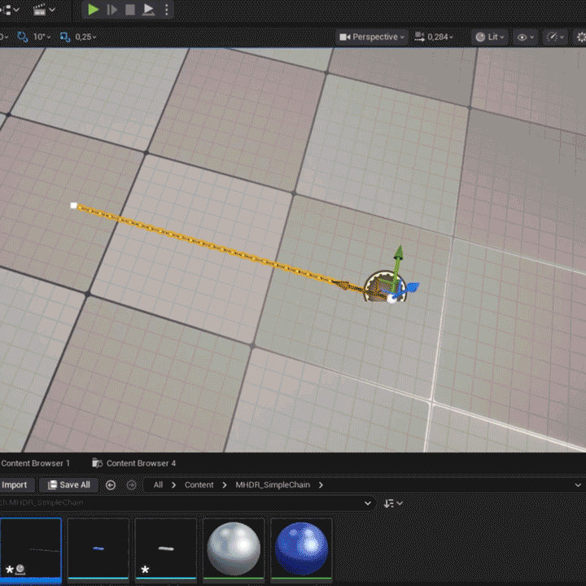

# MHDR Simple Chain for Unreal Engine

A lightweight procedural Blueprint for creating configurable chains in Unreal Engine.

## Features

- Blueprint-based
- Procedural chain generation
- Lightweight assets
- Modular workflow
- Industrial visualization ready

## Roadmap

- Adjustable chain spacing
- End connectors
- Multiple chain presets
- Plugin packaging

## License

MIT
